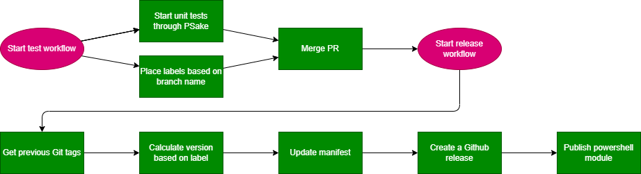

# Workflow

In this document we describe how our test and release workflows work. The test workflow starts when a pull request opens and the release workflow starts when there is a commit on the main branch with a change in the folder InSpark.InfrastructureAsCode.

## Pull request labels

When a pull request opens the test workflow will start to set labels based on the head branch. You can find the labels in the file [pr-labeler.yml](../../.github/pr-labeler.yml). The labels are used in other actions to determine the version or changes. The workflow will check if one of these labels are set and will then be added as a reviewer. You can also choose to set the labels manually if you are not on the right branch.

Reference:

- [Github - TimonVS - pr-labeler-action](https://github.com/TimonVS/pr-labeler-action)
- [Github - NathanielHill - check-pr-label-action](https://github.com/NathanielHill/check-pr-label-action)

## Unit testing

Before merging the PR, PSake will test the module with Pester and PSScriptAnalyzer. The tests will be performed on different operating systems (Windows, Linux, Mac OS). The Pester tests are located in [tests/](../../tests) and the PSScriptAnalyzer settings can be found in [ScriptAnalyzerSettings.psd1](../../tests/ScriptAnalyzerSettings.psd1).

Reference:

- [Github - PowerShellBuild](https://github.com/psake/PowerShellBuild)

## Search for previous tags

When the labels are present and the unit tests complete whithout any errors, the pull request will be merged into the main branch and the release workflow will start. The first action that takes place is the search for previous tags. This is required to determine the new version of the module. When no tags are found, the version 0.0.0 will be given.

Reference:

- [github-action-get-previous-tag](https://github.com/WyriHaximus/github-action-get-previous-tag)

## Calculating the new version

All our versions are SemVer based and are calculated based on the labels that are set in the pull request. Examples:

- patch: 0.0.0 -> 0.0.1
- minor: 0.0.0 -> 0.1.0
- major: 0.0.0 -> 1.0.0

## Updating the manifest

The manifest [InSpark.InfrastructureAsCode.psd1](../../InSpark.InfrastructureAsCode/InSpark.InfrastructureAsCode.psd1) will be updated with the following information:

- New version
- Release notes (The name of the pull request)
- The Project URL (The Github repo URL)

## Create a github release

After a new commit on the main branch, there will be GitHub release created based on a template that can be found in [release.yml](../../.github/release.yml). The template will look for all pull request between the two (previous and current) versions based on SemVer and add the pull request title and link to different sections. Because this workflow runs after every pull request there will always be one pull request linked in the github release.

Reference:

- [Github - Automatically generated release notes](https://docs.github.com/en/repositories/releasing-projects-on-github/automatically-generated-release-notes)

## Publishing the module

When the manifest is updated the module is ready to be published. We use PSake to publish the module as well.
We first make sure that the PowerShell repository is registered. For this reason we switched to a Windows runner, because the CmdLet Register-PSRepository does not work on a Linux runner. After this we will PSake publish the module to the repository. This will only work if the version is higher then the latest available version.

Reference:

- [Github - PowerShellBuild](https://github.com/psake/PowerShellBuild)
- [Azure DevOps - Use an Azure Artifacts feed as a private PowerShell repository](https://docs.microsoft.com/en-us/azure/devops/artifacts/tutorials/private-powershell-library?view=azure-devops)
